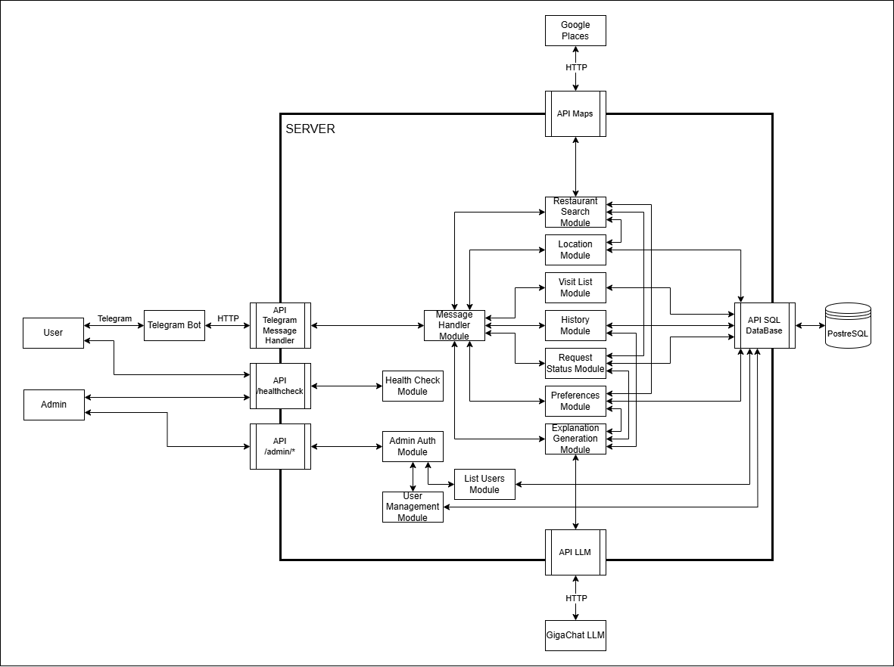

# Архитектура приложения Restaurant Advisor Bot

## Требования к технологическому стеку

- Java 25
- Spring Framework 7
- Spring REST
- Spring JDBC
- Spring Rest Docs
- Java Telegram Bot API
- PostgreSQL
- Gradle
- Docker
- Docker Compose
- JUnit 5
- Testcontainers

## Описание компонент

| Модуль | Назначение |
|-----------|------------|
| **Telegram Bot** | Пользовательский интерфейс в мессенджере Telegram. Принимает команды, геолокацию, нажатия и передает их через HTTP на сервер приложения. |
| **API Telegram Message Handler** | HTTP-эндпоинт, принимающий обновления от Telegram. Валидирует токен, парсит входящие данные и передает управление в Message Handler Module. |
| **API Healthcheck** | Публичный эндпоинт для мониторинга состояния системы. Доступен без аутентификации. |
| **API Admin Endpoints** | Набор административных эндпоинтов, защищенных ключом. |
| **Message Handler Module** | Центральный диспетчер команд. Разбирает текст сообщений, определяет команду, вызывает соответствующие модули и формирует ответ для Telegram. Обрабатывает все пользовательские команды. |
| **Preferences Module** | Управление диетическими и вкусовыми предпочтениями пользователя. Обеспечивает лимит 10 записей, добавление, удаление и просмотр списка. |
| **Location Module** | Обработка местоположения: установка по названию города с валидацией, прием геолокации от Telegram, определение координат центра города. Хранит текущее местоположение пользователя. |
| **Visit List Module** | Управление списком ресторанов "Посетить". Позволяет добавлять, удалять, отмечать как посещенные и просматривать список. |
| **History Module** | Хранение и предоставление истории посещенных ресторанов. Возвращает последние 50 записей для команды `/history`. |
| **Request Status Module** | Отслеживание состояния длительных операций: поиск ресторанов и генерация объяснения. Хранит в БД связку `(telegramId, requestId, тип операции, статус)`. Используется для проверки `/status` и предотвращения одновременных повторных запросов. |
| **Restaurant Search Module** | Выполняет поиск ресторанов. Использует текущее местоположение из Location Module и предпочтения из Preferences Module для формирования запроса. Возвращает до 5 ресторанов с данными для отображения карточек. При старте поиска блокирует повторный поиск через Request Status Module. |
| **Explanation Generation Module** | Генерирует персонализированное объяснение рекомендации с помощью LLM. При нажатии кнопки проверяет наличие активного запроса для пары (пользователь, ресторан). Создает запись статуса `PENDING`, отправляет промежуточное сообщение "Генерирую объяснение…", вызывает LLM API. Результат сохраняет в истории и отправляет пользователю. В случае ошибки обновляет статус на `FAILED`. |
| **User Management Module** | Управление пользователями: создание при первом обращении, хранение Telegram ID и роли. Предоставляет список пользователей для административных функций. |
| **Admin Auth Module** | Аутентификация административных HTTP-запросов. Проверяет наличие и корректность ключа. |
| **List Users Module** | Обрабатывает эндпоинт `GET /users`. После проверки ключа через Admin Auth Module возвращает список зарегистрированных пользователей. |
| **Health Check Module** | Реализует `/healthcheck`. Возвращает статус системы и список авторов. |
| **API SQL DataBase** | Cлой доступа к базе данных. Инкапсулирует все операции с SQL базами данных. Предоставляет репозитории для всех сущностей. |
| **API Maps** | HTTP-клиент для взаимодействия с картами. Реализует логику повторных попыток при таймауте. |
| **API GigaChat** | HTTP-клиент для LLM. Выполняет POST-запросы с промптами и обрабатывает ответы. |
| **PostgreSQL** | Реляционная база данных. Хранит все постоянные данные: пользователей, предпочтения, местоположения, списки "Посетить", историю посещений, статусы запросов. |
| **GigaChat LLM** | Внешняя LLM, используемая для генерации объяснений рекомендаций. |
| **Google Places API** | Источник данных о ресторанах: название, адрес, рейтинг, координаты. |

## Схема

